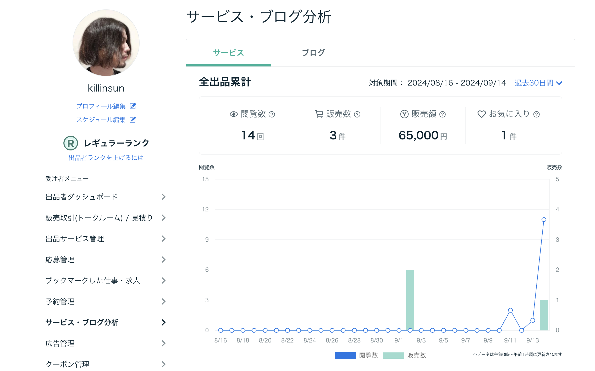

とても胡散臭いタイトルだ・・・

## きっかけ

今の仕事をやり続けてもソフトウェアエンジニアとして十分成長できるが、成長するジャンルが限られている。たとえば「フロントエンドのスキルを伸ばしたい」とか「ユーザーと対話して良いものを作れるようになりたい」と考えた時に、今の仕事でも十分伸ばせるんだけど、もっとスピード感もって上げたいと思ったら場数と挫折を乗り越えていく必要があると思った。

あとは、強い理由とかはないんだけど単純に人生のマイルストーンというか、実績アンロックしたいなという意味で3年以内には年収 1,000 万に到達したいという個人的な目標があった。
これも今の職場で目指せないこともないけど、とにかく自分で動いて案件をこなしていく力が何かの役に立つかもしれないと思って始めた。

あれこれ考えすぎても仕方ない部分があるので、まずは動いてみようでココナラを使ってみることにした。

## 事前調査

単発型の依頼で、どんなものがあるかざっくりと見てみた。

すぐにできそうな依頼は当然、競合も応募してるし、単価バトルになっているという噂もある。
また、明らかに不可能な依頼や、規模が大きすぎて初期に終わるには大変なものもあった。

いくつか眺めてると、「これ、もしかして出てる情報でプロトタイプ作れそうじゃね？」という案件をちらほら見かけた。

### 「もう動かせるものあるんですけど、どうですか？」と売り込みできたら強い

本業でも商談に臨む時は必ずデモをするし、理想は「契約してくれたらもうこれそのまま使えますよ」という状態まで準備したものを見せることだ。

このやり方がココナラにおける案件獲得でも活かせるんじゃないかなと考えた。

### 発注者が実績を気にするのは「ちゃんとしたものを作ってくれるか判断つかないから」

逆に言えば、「ちゃんとしたもの」を作って「多分、まだ要望はあると思いますが、これベースに一緒に考えて行きませんか？」と添えて提案することで、発注者側は他の競合より解像度が幾分高い状態で考えてくれる。

発注者が募集をかけてからクローズするまでの間に、７〜８割動くものが出てきたら、よほど方向性のズレたものでない限りはそっちを選ぶはずだ。

## プロトタイプを作る

諸々の戦略がまとまったので、とりあえず案件2つに対してプロトタイプを作ることにした。土日を使って1日１プロトタイプのイメージで進めて行った。

### 1つ目

1つ目の案件は、あるWebページからデータを収集し、他のアプリでCSVインポートを使ってデータの挿入ができるようにするもの。
これは物量が多く、バリエーションも多様だったがバックエンドに叩いているAPIを解析して Python で直接バックエンドにGETを仕掛けていってデータを収集した。（サイトに迷惑がかからないように常識的な範囲で）

１〜２時間ほどでできたので、7,000円で見積もり提案。
加えて、2,000円追加で払ってくれれば画像も取得して発注者が使うアプリで画像も表示できるようにする、という形にした。

そして50件ほどお試しで取得したCSVファイルを添付した。

### 2つ目

2つ目の案件は、AIを活用したWebアプリだった。
メイン機能だけ React + Vite で作り、Github pages にSPAとしてアップロードして外部公開可能な形にして提案に出した。
フロントエンドだけしか作っていないが、OpenAIのGPTを使うアプリだったので、APIキーは都度入力してもらって使えるような形にした。
本実装の時はバックエンド含めてちゃんとやればいいので。
OpenAI のAPIキーはこっちで払い出して提案文に添えた。

これは大体１万円で提案した。

## 受注

目論見通り、両方ともすぐに受注した。
特に1件目は追加で取得したい要素など、進めていくうちに追加されていき、合計で２〜３時間ほどプロトタイプからの改修が入ったが、やり取りをかなり迅速にしていったので、無事★５評価をいただけた。
さらに、合計9,000円という微妙に中途半端な金額が項を制してか、感謝の気持ちという形で追加 1,000円の「おひねり」をいただけた。

2件目のプロトタイプも好評だった。とても前のめりで要件定義につきあってくださるので、プロトタイプから製品版として提供するためにどんな機能が必要か、さらにスコープが広がっていった。

スコープは広がってしまったものの、当初の 1万円の見積もりよりもはるかに高い 50,000円の相手側予算まるまるいただく形で提案させてもらった。
深掘りしてみると、Webアプリを載せるためのサーバーなどの準備がなかったため、インフラ含めて構築する必要があることがわかった。それらの準備代行も含めて最終的に 55,000円で購入いただいた。

### 2件目の開発の進め方について

２週間後を納期としていたが、朝活の２〜３時間と、土日を使って開発して大体5日ぐらいで開発は終わった。残りの１週間は本提供用のインフラの準備のサポートだった。
初期から自分用の環境に CI/CD まで含めたパイプラインを構築して発注者でも「動かせるもの」を触れる状態にした。アジャイルである。

出来上がってから「思ってたのと違う」と言われるリスクがない分、お互い前のめりで開発できてしまう。そうすると、今度は逆にもらってるお金、納期に対して追加の機能要望がバコスカと増えていく状態になってしまい、こちらとしても時間単価が減っていってしまうため丁寧に説明して、追加見積もりに回してもらうことで納得いただけた。

3日早く納品完了し、★5評価をいただけた。また、すぐに追加要望の見積もりの話にもなり、20,000円で発注してもらえることとなった。

## やってみて

プロトタイプを作って提案できる案件はそう多くないが、力試しだと思って受注できなくても趣味のような感じで作っていくのはソフトウェアエンジニアとしてのスキル向上にも良さそうだし、何より気分転換になる。
発注者の興味を惹いて案件獲得まで進めればビジネス的な知識や経験も積めるため、個人的にはさまざまなソフトウェアエンジニアにおすすめしたい。

## ちょっとした悩み

今年は雑収入の範囲でやれればいいかなと考えてたけど、このままいくと確定申告が必要なラインに到達してしまうので、開業届を出して青色申告のことまで考える必要がでてきてしまった。

/以上
